# Carotis-AI - Was wirklich passiert ist

**Briefing fuer Dr. Aroob Alrawashdeh**  
**Stand:** 2026-05-01  
**Ziel:** In kurzer, visueller Form zeigen, was in den Runs passiert ist, welche Agenten beteiligt waren, was sich geaendert hat und wie viel menschliche Arbeit das ungefaehr ersetzt oder vorgezogen hat.

---

## 1. Kurzfassung

In wenigen Tagen wurde aus einem Promotionskonzept ein technisch pruefbarer Prototyp-Stack:

| Bereich | Vorher | Jetzt |
|---|---|---|
| Idee | Konzept fuer Carotis-Stenose-KI | Lokaler Edge-AI-Prototyp mit Backend, Frontend, ML-Pipeline, XAI und Audit-Trail |
| Rohde-Strategie | Mail mit Konzeptpapier | Mail mit Live-Demo, Token, Anleitung, Walkthrough und synthetischen Faellen |
| Datenschutz | Plan / Anspruch | Architektur technisch auf Local-First, SQLite, DICOM-Anonymisierung und kein Cloud-Patientendatenexport getrimmt |
| Erklaerbarkeit | Allgemeine XAI-Idee | Grad-CAM/HiResCAM, SHAP-Konzept, Trust-Score und Decision-Tree-Capture |
| Nachvollziehbarkeit | Lose Notizen | 87 relevante Run-Logs, MEMORY-Index, ULTRAPLAN, Agent-Harness, Tests und Runbooks |

Die wichtigste Aenderung: Wir zeigen Prof. Rohde nicht mehr nur "was wir machen wollen", sondern "was bereits gebaut, getestet und demonstrierbar ist".

---

## 2. Zahlenbild

| Kennzahl | Stand |
|---|---:|
| Relevante Run-Logs | 87 |
| Maschinenlesbare Tasks | 64 |
| Davon erledigt | 58 |
| Offene echte Tasks | 6, fast alle abhaengig von P3/P5/P6 oder menschlichen Deploy-Schritten |
| Backend-Testbaseline | 120 passed, 11 skipped |
| Frontend-Testbaseline | 29 Vitest-Tests passed |
| Rohde-E2E | 7/7 Tests gruen |
| MCP/Agent-Harness | Obsidian, Graphify, Hermes, Browser, Combined MCP |
| Aktueller Hauptblocker | Nicht Code, sondern DNS/SSH/Fly-App/Versandentscheidung |

---

## 3. Agenten-Orchester

| Agent / Rolle | Was er gemacht hat | Wert fuer Aroob |
|---|---|---|
| Opus 4.7 | Architektur, P0/P1/P3-Planung, regulatorische Texte, Rohde-Strategie, Handoffs | Macht aus der Idee eine medizinisch und wissenschaftlich erzaehlbare Linie |
| Kimi K2.6 | Bulk-Umsetzung, Code-Stack, Tests, Stride-Prompts, ULTRAPLAN, Deploy-Unblock per Browser | Sehr viel Volumen in kurzer Zeit: Dateien, Fixes, Prompts, Tests |
| Codex GPT-5.5 | Code-Audit, Deploy-Hardening, ML/ONNX-Optimierung, Security, Browser-Smoke, Memory-Cleanup | Stabilisiert das System und verhindert, dass Demo/Repo nur "schoen aussieht" |
| Copilot / GPT-5.3-Codex | Claude-Design-Prototyp, Chromium/Playwright-Sichtpruefung, UI-Harness | Macht die Idee visuell und fuer Rohde sofort begreifbar |
| Hermes/Ollama lokal | Lokaler Agenten-Layer, Memory-/Reflection-Konzept, keine Patientendaten-Cloud | Passt zur Local-First-Story und zeigt technische Selbststaendigkeit |
| Claude Design Verifier | Automatische UI-Fehlerkorrektur im Design-Prototyp | Beschleunigt visuelle Iteration ohne langen manuellen Debug-Zyklus |
| Graphify/Obsidian/Browser MCP | Knowledge-Graph, Vault-Suche, Browser-Automation, Tool-Orchestrierung | Macht die Arbeit rekonstruierbar und graphisch auswertbar |

**Einordnung:** Nicht ein einzelner Chat hat "ein bisschen Text" produziert. Es war ein koordiniertes Agenten-System mit Rollen: Planen, Bauen, Testen, Reparieren, Visualisieren, Deployment vorbereiten, Memory schreiben.

---

## 4. GraphGen / Mermaid-Ansicht

```mermaid
flowchart TD
    A[Carotis-AI Idee] --> B[Opus: Architektur + Rohde-Strategie]
    B --> C[Kimi: Code-Stack + Bulk-Tasks]
    C --> D[Codex: Audit + Security + Deploy-Hardening]
    D --> E[Tests: Backend 120, Frontend 29, E2E 7]
    C --> F[ML: MFSD-UNet, ONNX, Calibration, Trust Score]
    C --> G[Frontend: DICOM UI, AI Panel, Decision Form]
    F --> H[XAI: Grad-CAM / HiResCAM / SHAP-Konzept]
    G --> I[Physician Override + Decision-Tree-Capture]
    H --> I
    I --> J[Daily-Learning-Loop Konzept]
    D --> K[Deploy: Fly Frontend + Hetzner Backend]
    K --> L{Offene externe Schritte}
    L --> M[DNS: carotis + api.carotis]
    L --> N[SSH-Verifikation Hetzner]
    L --> O[Fly-App/Domain final]
    E --> P[Rohde-Demo bereit fuer Pre-Send-Smoke]
    O --> P
    P --> Q[Aroob sendet Mail an Prof. Rohde]
```



---

## 5. Was sich konkret geaendert hat

### Medizinisch-wissenschaftlich

- Carotis-AI wurde als Promotionsprojekt mit klarer P0-P7-Roadmap strukturiert.
- Der wissenschaftliche Kern wurde geschaerft: nicht nur Segmentierung, sondern Decision-Tree-Harvesting, also Lernen aus aerztlichen Begruendungen.
- Rohde wird nicht mit Marketing angesprochen, sondern mit Kliniknutzen: lokale Daten, erklaerbare KI, Audit-Trail, klinische Validierung.
- P1-Materialien sind vorbereitet: Ethik-Skelett, DPIA, AVV, Risk Register, ADRs.

### Technisch

- FastAPI-Backend mit Health, Inference, Decision-Tree, Audit und Demo-Endpunkten.
- React/Vite-Frontend mit DICOM-Viewer-Struktur, AI-Panel, Confidence-Badge, Decision-Form, AuthGate und Walkthrough.
- ML-Pipeline mit MFSD-UNet, Training, Losses, ONNX-Export, Calibration und XAI-Komponenten.
- DICOM-Anonymisierung und PII-Checks wurden eingebaut.
- Append-only Audit-Trail und Security-Headers/API-Key-Mechanik wurden gehaertet.
- Tests wurden mehrfach repariert und erweitert, statt Fehler zu ignorieren.

### Demo / Rohde

- Strategie-Pivot: von "Konzept schicken" zu "Live-Demo mit Token zeigen".
- 30 synthetische Demo-Faelle und Walkthrough-Konzept.
- Rohde-Anleitung, Video-Skript, Mail-v3-Prompt, Pre-Send-Runbook.
- Claude-Design-Prototyp zeigt visuell: Patient, Viewer, Grad-CAM, AI-Panel, SHAP/Trust, Override.

### Agenten-Harness

- ULTRAPLAN wurde zur verbindlichen Betriebsanleitung fuer alle Agenten.
- Run-Logs verhindern Kontextverlust.
- MCP-Server verbinden Obsidian-Memory, Graph, Browser und Hermes.
- Bekannte Fehler wurden dokumentiert, damit sie nicht wieder eingebaut werden.

---

## 6. Menschliche Stunden - realistische Schaetzung

Das ist keine exakte Zeiterfassung, sondern eine konservative Engineering-Schaetzung aus Umfang, Testlast, Dokumentation und Korrekturschleifen.

| Arbeitspaket | Menschliche Arbeit bei sauberer Umsetzung |
|---|---:|
| Architektur, Roadmap, Rohde-Strategie, Handoffs | 40-70 h |
| Literatur-/Trust-/CDS-/XAI-Recherche | 45-80 h |
| Backend, DB, Auth, Audit, PII, API | 80-130 h |
| Frontend, DICOM-UI, AI-Panel, Walkthrough, Tests | 70-120 h |
| ML-Pipeline, ONNX, Calibration, XAI | 70-120 h |
| DevOps, Deploy-Files, GitHub Actions, Fly/Hetzner | 45-80 h |
| Tests, Debugging, Regression-Fixes | 60-100 h |
| Dokumentation, Runbooks, Stride-/Office-Prompts | 50-90 h |
| Agent-Harness, MCP, Graphify, Memory-System | 50-90 h |
| **Gesamt konservativ** | **510-880 h** |

Als menschliches Projekt entspricht das ungefaehr:

| Teamform | Dauer |
|---|---:|
| 1 sehr guter Full-Stack/ML-Engineer allein | 13-22 Arbeitswochen |
| 2 Engineers + 1 Research/Docs-Person | 5-9 Wochen |
| Kleines eingespieltes Team mit DevOps/ML/Frontend | 3-6 Wochen |

Warum ging es hier schneller? Weil die Agenten parallel dachten, Fehler sofort dokumentierten, Tests automatisch wiederholt wurden und viele Routinearbeiten nicht von Hand getippt wurden. Die kreative Arbeit lag nicht nur im Code, sondern in der Orchestrierung: welche Aufgabe an welchen Agenten, wann stoppen, wann testen, wann dokumentieren.

---

## 7. Kreativitaets-Mass

| Kreative Leistung | Warum sie nicht trivial ist |
|---|---|
| Decision-Tree-Harvesting | Der Arzt korrigiert nicht nur ein Ergebnis, sondern liefert trainierbare Begruendungsdaten |
| Local-First Edge AI | Passt zu DSGVO/Klinikum: Patientendaten bleiben lokal |
| Trust-Score statt roher Confidence | Reduziert falsches Vertrauen in KI und macht Unsicherheit klinisch sichtbar |
| Grad-CAM/HiResCAM plus Override | Erklaerung und aerztlicher Widerspruch werden zusammen gedacht |
| Live-Demo statt Konzept-Mail | Rohde sieht Reifegrad sofort, nicht nur Absicht |
| Agent-Harness mit Run-Logs | Das Projekt wird reproduzierbar und nicht abhaengig von einem einzelnen Chatverlauf |
| Graphify/MCP | Wissen wird als Graph und Memory nutzbar, nicht als verlorene Chat-Historie |

Kurz gesagt: Die Kreativitaet liegt in der Verbindung von Medizin, Datenschutz, KI-Erklaerbarkeit, Software-Engineering und Promotionsstrategie.

---

## 8. Wo wir wirklich stehen

```text
Fertig:
[##########] Konzept / Roadmap / Rohde-Strategie
[#########.] Backend / Security / Audit / API
[#########.] Frontend / Demo-Shell / Walkthrough
[########..] ML-Pipeline / XAI / ONNX / Calibration
[#########.] Tests / Regression-Fixes
[#########.] Dokumentation / Runbooks / Agent-Harness

Noch offen:
[###.......] Live-Deploy final: DNS, SSH-Verifikation, Fly-App/Domain
[##........] Mailversand: Aroob final pruefen und senden
[..........] Echte Patientendaten: erst nach Rohde, Ethik, DSGVO, Anonymisierung
```

Der kritische Punkt ist deshalb nicht mehr: "Kann Lou das bauen?"  
Der kritische Punkt ist jetzt: "Duerfen und sollen wir das mit Prof. Rohde in die klinische Validierung bringen?"

---

## 9. Was Aroob Prof. Rohde einfach sagen kann

"Wir haben nicht nur ein Thema fuer eine Promotion formuliert. Lou hat bereits einen lokalen, datenschutzorientierten Prototypen mit erklaerbarer KI, Audit-Trail, Demo-Faellen und Testabdeckung aufgebaut. Die Demo nutzt keine echten Patientendaten. Der naechste Schritt waere Ihre fachliche Einschaetzung, ob das als klinisch sinnvolles Promotionsprojekt am Klinikum Dortmund weiterverfolgt werden soll."

---

## 10. Naechste 5 Schritte

1. DNS-Eintraege final setzen: `carotis.diggai.de` und `api.carotis.diggai.de`.
2. Hetzner-SSH verifizieren und Backend-Deploy ausloesen.
3. Fly-App/Domain finalisieren und Frontend-Deploy pruefen.
4. Pre-Send-Runbook einmal komplett durchgehen.
5. Aroob prueft Mail und sendet an Prof. Rohde.
# Update 2026-05-11

Dieses Briefing ist als historische Agenten-/Build-Zusammenfassung weiter nuetzlich, aber fuer das heutige Gespraech gilt zuerst: `outputs/Aroob_Today_Briefing_2026-05-11.md`.

Wichtige Aenderungen seit diesem Dokument:

- Live-Demo laeuft inzwischen auf Hetzner unter `https://carotis.diggai.de/` und `https://api.carotis.diggai.de/`; Fly.io ist kein aktives Ziel mehr.
- Der Projekt-Frame wurde von "Diagnoseassistent/MDR Class IIa" auf "Forschungsprototyp fuer Workflow- und Decision-Tree-Capture" gedreht.
- Der Code-Disclaimer-Audit vom 2026-05-10 hat kritische Restarbeit gefunden: Splash-Gate, Watermark, CDS-Feature-Flag-Gating und UI-Begriffe muessen vor externem Stakeholder-Versand final verifiziert werden.
- Aroob/Rohde-Kommunikation darf keine aktuelle Klinikum-Dortmund-Anstellung fuer Aroob behaupten; Rolleninfo exakt mit Aroob klaeren.

---

